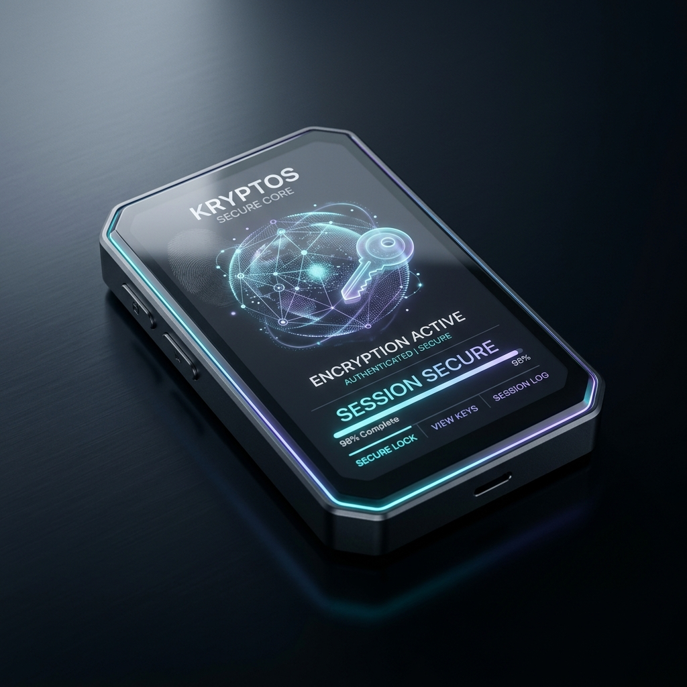

# 
🛡️ CIPHERLAYER

  

  <b>The Silicon Standard in Digital Encryption Handshaking</b>

  
  
  

  

---

## ⚡ SYSTEM CAPABILITIES

**CipherLayer** is a multi-platform security suite designed to provide absolute data sovereignty. It wraps every communication in 12 layers of shifting entropy using the proprietary PolyShield™ engine.

### 🧬 Core Modules

| Module | Description | Impact |
| :--- | :--- | :--- |
| 🛡️ **PolyShield™** | 12-layer custom encryption cascade. | **Critical** |
| 📱 **Overflow Mode** | Real-time overlay for messaging apps. | **Extreme** |
| 💻 **PC CLI** | Native terminal interface for power users. | **Premium** |
| 💳 **Secure Nodes** | Razorpay-verified Elite tier access. | **High** |
| 🧠 **AI Assistant** | Gemini-powered privacy consultation. | **Essential** |

---

## 📸 INTERFACE OVERVIEW

  <i>"Privacy is not a feature. It is a fundamental right."</i>

---

## 🛠️ HARDWARE & LOGIC

- **Frontend:** Next.js 16 (Apple Pro Aesthetic)
- **Engine:** PolyShield™ Custom Crypto Suite
- **Desktop:** Tauri (Rust-powered Overlay)
- **Mobile:** Capacitor (Android Native)

---

## 📥 INITIALIZATION

1. **DOWNLOAD:** Grab the latest binary from the [Actions Tab](https://github.com/jogeshd/cipherlayer/actions).
2. **INSTALL:** Side-load the APK onto your Android device or run the Windows installer.
3. **AUTHORIZE:**
    - Grant **Display Over Other Apps** (for Overflow Mode).
    - Grant **Clipboard Access** (for real-time decryption).

---

  © 2026 CIPHERLAYER PROJECT. SYSTEM STATUS: <b>ELITE</b>

  

